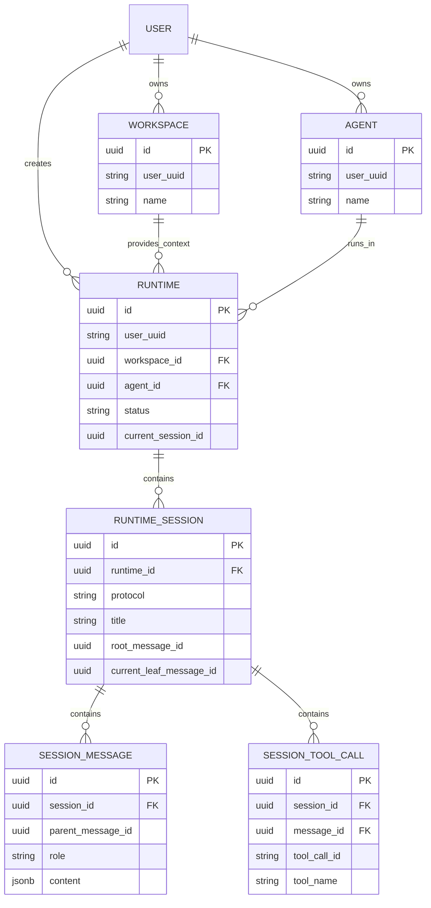

# Database Schema

Cohub uses a layered runtime model:

- **Workspace**: the reusable hosted project unit
- **Agent**: executable logic that can run in a workspace
- **Runtime**: the outer lifecycle instance created from a workspace + agent
- **Session**: an internal LLM / conversation session inside a runtime
- **Session Message Tree**: the branchable conversation history inside a session

The database stores:
- indexing and relations for workspaces and agents
- runtime lifecycle state
- internal sessions for each runtime
- session message trees and tool calls

## ER overview

## Core tables

### 1. `workspaces`
Hosted, reusable project units.

### 2. `agents`
Executable behavior definitions that can be launched from workspaces.

### 3. `runtimes`
Outer runtime lifecycle instances.

A runtime is the object users conceptually enter when they launch an agent from a workspace. It may be running, sleeping, resumable, or stopped.

### 4. `runtime_sessions`
Internal LLM / conversation sessions belonging to a runtime.

A runtime can contain one or more sessions. Each session has its own tree state and current leaf.

### 5. `session_messages`
Tree nodes for a session's branchable conversation history.

### 6. `session_tool_calls`
Structured tool calls attached to assistant/system messages inside a session.

## Design notes

1. **Runtime vs Session**
   - A runtime is the outer lifecycle object.
   - A session is the inner LLM conversation object.

2. **Tree structure**
   - Sessions are modeled as tree-shaped message histories.
   - `parent_message_id` + `current_leaf_message_id` are the core truth.

3. **Protocol compatibility**
   - Session message content and tool calls are stored in a protocol-friendly shape so they can ingest data from `pi`, ACP-compatible agents, or internal adapters.

4. **Caching fields**
   - Counters and preview fields such as `latest_message_text`, `total_messages`, and `total_tool_calls` are denormalized read optimizations.
