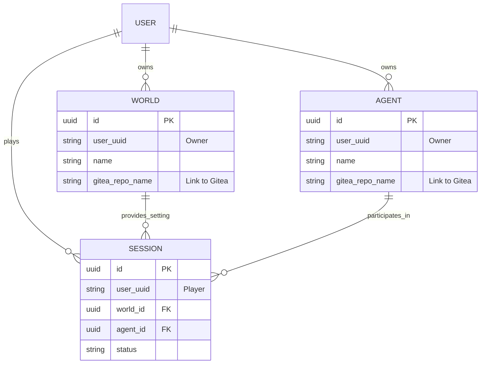

# 核心数据库 Schema 设计 (PostgreSQL)

系统采用了 **“代码即设定 (Config as Code / Setting as Code)”** 的理念，因此 `World` 和 `Agent` 的**核心内容数据**（如 markdown 设定档、json 属性）直接托管在 Gitea 仓库中。

PostgreSQL 数据库主要负责：
1. **索引与元数据 (Meta & Index)**：缓存 Gitea 中的基础信息，用于 Web 端的快速检索、列表和分类。
2. **关系绑定 (Relations)**：管理 World、Agent、User 之间的关联。
3. **运行时状态 (Runtime State)**：管理 `Session` 的生命周期和对话历史。

*(注：系统中的账号体系由外部 OIDC 等统一管控，数据库中仅使用 `user_id` 字符串进行关联。)*

## ER 图 (核心架构)



---

## DDL (表结构定义)

### 1. 资产索引表 (Assets)

用于映射 Gitea 中的数据，方便在 Web 站上进行聚合查询、点赞、统计等，而不需要每次都调 Gitea API。

```sql
-- 世界表 (World)
CREATE TABLE worlds (
    id UUID PRIMARY KEY DEFAULT gen_random_uuid(),
    user_uuid VARCHAR(255) NOT NULL,          -- 外部 User UUID (Owner)
    name VARCHAR(255) NOT NULL,               -- 世界名称 (冗余 Gitea repo name)
    description TEXT,                         -- 简要描述
    gitea_repo_name VARCHAR(255) NOT NULL,    -- 例如 "user/cyberpunk-city"
    default_branch VARCHAR(50) DEFAULT 'main',
    visibility VARCHAR(20) DEFAULT 'public',  -- public / private
    created_at TIMESTAMPTZ DEFAULT NOW(),
    updated_at TIMESTAMPTZ DEFAULT NOW()
);
CREATE INDEX idx_worlds_user_uuid ON worlds(user_uuid);

-- 智能体/角色表 (Agent)
CREATE TABLE agents (
    id UUID PRIMARY KEY DEFAULT gen_random_uuid(),
    user_uuid VARCHAR(255) NOT NULL,
    name VARCHAR(255) NOT NULL,
    description TEXT,
    gitea_repo_name VARCHAR(255) NOT NULL,
    default_branch VARCHAR(50) DEFAULT 'main',
    visibility VARCHAR(20) DEFAULT 'public',
    created_at TIMESTAMPTZ DEFAULT NOW(),
    updated_at TIMESTAMPTZ DEFAULT NOW()
);
CREATE INDEX idx_agents_user_uuid ON agents(user_uuid);
```

### 2. 运行时表 (Runtime & Stateful)

这是 Netaverses 作为“引擎”最核心的表，记录了谁、用什么角色、进入了哪个世界。

```sql
-- 会话表 (Session)
CREATE TABLE sessions (
    id UUID PRIMARY KEY DEFAULT gen_random_uuid(),
    user_uuid VARCHAR(255) NOT NULL,          -- 发起会话的玩家/用户 UUID
    world_id UUID REFERENCES worlds(id),
    world_commit_hash VARCHAR(40),            -- 锁定 World 版本，防止世界设定变更影响正在运行的会话
    agent_id UUID REFERENCES agents(id),
    agent_commit_hash VARCHAR(40),            -- 锁定 Agent 版本
    
    title VARCHAR(255),                       -- 会话标题 (可选，如 "赛博朋克第一局")
    status VARCHAR(50) DEFAULT 'active',      -- active, paused, archived
    
    created_at TIMESTAMPTZ DEFAULT NOW(),
    updated_at TIMESTAMPTZ DEFAULT NOW()
);
CREATE INDEX idx_sessions_user_uuid ON sessions(user_uuid);
```

## 设计亮点与考量

1. **版本锁定 (`commit_hash`)**: 在 `sessions` 表中记录了 `world_commit_hash` 和 `agent_commit_hash`。这非常关键！由于 World 和 Agent 是托管在 Gitea 中的，如果不锁定 hash，创作者修改了设定的 main 分支，可能会导致正在游玩的 Session 逻辑崩溃（所谓的“世界线变动”）。
2. **外部账号友好**: 所有的 `user_uuid` 都采用 `VARCHAR`，完美兼容 OIDC (如 Authing, Keycloak) 传入的 UUID 或字符串形式的主键。

