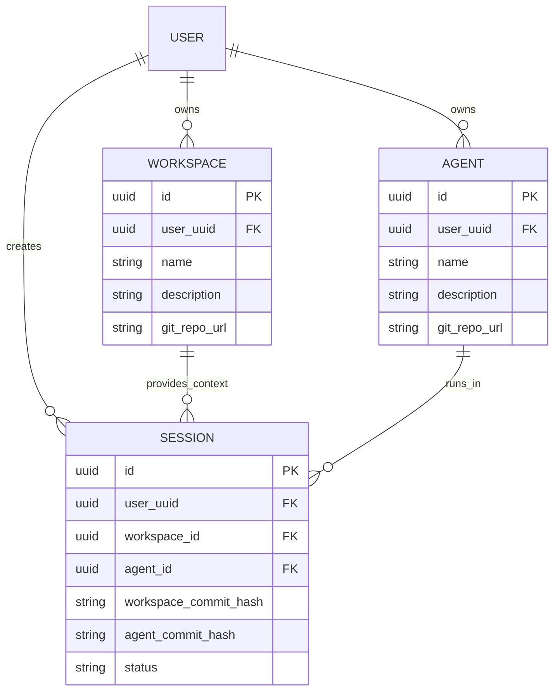

# Database Schema (Phase 1 MVP)

系统采用了 **“代码即设定 (Config as Code / Setting as Code)”** 的理念，因此 `Workspace` 和 `Agent` 的**核心内容数据**（如 markdown 设定档、json 属性、知识库文档）直接托管在底层的版本控制系统或对象存储中。

关系型数据库 (PostgreSQL) 仅用于存储**关系映射**、**索引**、**用户状态**及**运行时（Session）状态**。

## 核心表设计理念

1. **索引与检索 (Index & Discovery)**：虽然核心数据在 Git/对象存储里，但我们需要在 DB 中存一份冗余的 Meta 数据（如 `name`, `description`, `avatar` 等），用于首页的列表展示、搜索和推荐，避免频繁调用底层存储 API。
2. **关系绑定 (Relations)**：管理 Workspace、Agent、User 之间的关联。
3. **运行时管理 (Runtime State)**：记录当前有哪些 Session 正在运行，对应哪个 Channel。

## ER 关系概览



## Schema 详述 (Drizzle)

### 1. `workspaces` (工作区表)

记录工作区的基本信息，用于大厅展示和快速检索。

```sql
-- 工作区表 (Workspace)
CREATE TABLE workspaces (
    id UUID PRIMARY KEY DEFAULT gen_random_uuid(),
    user_uuid UUID NOT NULL,                  -- 创建者/所有者 ID (后续关联 auth 体系)
    name VARCHAR(255) NOT NULL,
    description TEXT,
    cover_image_url TEXT,                     -- 封面图 URL
    git_repo_url VARCHAR(512) NOT NULL,       -- 底层存储库地址 (核心数据所在)
    is_public BOOLEAN DEFAULT false,          -- 是否公开在广场展示
    created_at TIMESTAMP DEFAULT now(),
    updated_at TIMESTAMP DEFAULT now()
);

CREATE INDEX idx_workspaces_user_uuid ON workspaces(user_uuid);
```

### 2. `agents` (智能体表)

记录 Agent 的基本信息，同样主要用于展示和索引。

```sql
-- 智能体表 (Agent)
CREATE TABLE agents (
    id UUID PRIMARY KEY DEFAULT gen_random_uuid(),
    user_uuid UUID NOT NULL,
    name VARCHAR(255) NOT NULL,
    description TEXT,
    avatar_url TEXT,
    git_repo_url VARCHAR(512) NOT NULL,
    is_public BOOLEAN DEFAULT false,
    created_at TIMESTAMP DEFAULT now(),
    updated_at TIMESTAMP DEFAULT now()
);

CREATE INDEX idx_agents_user_uuid ON agents(user_uuid);
```

### 3. `sessions` (运行会话表)

记录一次运行时的生命周期。代表一个 Agent 被放入了一个具体的 Workspace 中。

```sql
-- 会话表 (Session)
CREATE TABLE sessions (
    id UUID PRIMARY KEY DEFAULT gen_random_uuid(),
    user_uuid UUID NOT NULL,                  -- 会话发起人
    workspace_id UUID REFERENCES workspaces(id),
    agent_id UUID REFERENCES agents(id),
    workspace_commit_hash VARCHAR(40),        -- 锁定 Workspace 版本
    agent_commit_hash VARCHAR(40),            -- 锁定 Agent 版本
    status VARCHAR(50) DEFAULT 'active',      -- active, paused, archived, error
    created_at TIMESTAMP DEFAULT now(),
    updated_at TIMESTAMP DEFAULT now()
);

CREATE INDEX idx_sessions_user_uuid ON sessions(user_uuid);
CREATE INDEX idx_sessions_workspace_id ON sessions(workspace_id);
CREATE INDEX idx_sessions_agent_id ON sessions(agent_id);
```

## 关键设计说明

1. **版本锁定 (`commit_hash`)**: 在 `sessions` 表中记录了 `workspace_commit_hash` 和 `agent_commit_hash`。这非常关键！由于 Workspace 和 Agent 的实际配置托管在底层存储中，如果不锁定 hash，创作者修改了设定的 main 分支，可能会导致正在运行的 Session 逻辑变更甚至崩溃。锁定 hash 保证了 Session 的确定性。
2. **User 模型**: Phase 1 暂不建立复杂的 Users 表，仅依赖外部 Auth 服务传递过来的 JWT 中的 `user_uuid` 作为标识即可，以此保证系统的轻量化并降低耦合。
