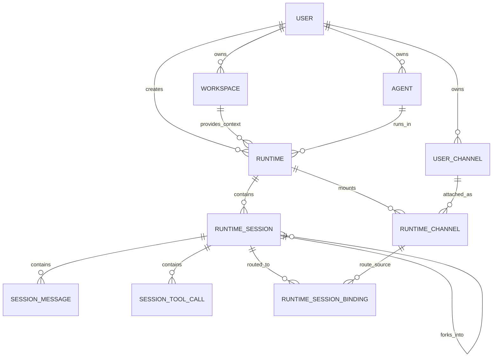
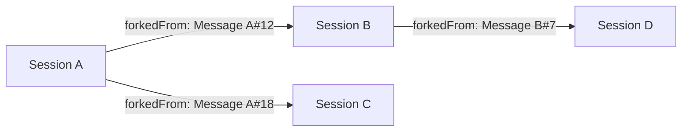

# Database Schema

本文档描述 Cohub 当前数据库设计。

请注意，数据库模型服务于项目的核心目标：

> **Workspace 托管 + 云端 Runtime 运行 + Runtime 内部 Session 组织**

因此，Runtime / Session / Channel 表结构都围绕 Workspace -> Runtime 这条主链路展开。

当前数据库模型统一为：

- Runtime 是外层运行实例
- Session 是 Runtime 内部的独立线性上下文
- Message 是 Session 内的线性消息记录
- Session 之间通过 fork 形成 lineage
- Channel 始终绑定 Session

---

## 1. 当前数据模型概览



### 这张图的主语义
- **Workspace / Agent -> Runtime** 是平台主链路
- **Runtime -> Session** 是 Runtime 内部的上下文组织方式
- **Channel / Binding** 是 Runtime 对外通信能力

---

## 2. 核心表

## 2.1 `runtimes`

外层运行实例。

### 主要字段
- `id`
- `userUuid`
- `workspaceId`
- `agentId`
- `title`
- `status`
- `meta`
- `createdAt`
- `updatedAt`

### 说明
Runtime 是 Workspace 云端运行后的主对象。

---

## 2.2 `runtime_sessions`

Runtime 内部的独立会话上下文。

### 主要字段
- `id`
- `runtimeId`
- `title`
- `status`
- `cwd`
- `protocol`
- `externalSessionId`
- `meta`

### Lineage 字段
- `parentSessionId`
- `forkedFromMessageId`
- `lineageRootSessionId`
- `forkDepth`

### 线性会话状态字段
- `lastMessageId`
- `latestMessageText`
- `lastMessageAt`

### 统计字段
- `totalMessages`
- `totalToolCalls`
- `totalInputTokens`
- `totalOutputTokens`
- `totalCost`

### 说明
这张表是当前 Runtime 内部运行态模型的中心。

它同时承担：
- Session 元信息
- Session lineage
- Session 最新状态缓存
- Session 统计聚合

---

## 2.3 `session_messages`

Session 内的线性消息记录。

### 主要字段
- `id`
- `sessionId`
- `role`
- `source`
- `externalMessageId`
- `protocolMessageId`
- `content`
- `text`
- `meta`
- `idempotencyKey`

### 线性顺序字段
- `sequence`
- `prevMessageId`

### 模型/计费字段
- `provider`
- `model`
- `stopReason`
- `errorMessage`
- `usageInput`
- `usageOutput`
- `usageTotalTokens`
- `costTotal`

### 说明
Message 表示 Runtime 内某个 Session 的线性历史记录。

---

## 2.4 `session_tool_calls`

assistant message 关联的工具调用记录。

### 主要字段
- `id`
- `sessionId`
- `messageId`
- `toolCallId`
- `toolName`
- `status`
- `args`
- `result`
- `content`
- `resultPreview`
- `isError`
- `meta`

### 说明
该表是结构化工具调用明细表，用于：
- timeline 展示
- 调试
- 结果预览
- 统计

---

## 2.5 `user_channels`

用户级 Channel 配置。

### 主要字段
- `id`
- `userUuid`
- `provider`
- `name`
- `credentials`
- `status`

### 说明
这一层描述“用户拥有哪些外部渠道配置”。

---

## 2.6 `runtime_channels`

将用户 Channel 挂载到某个 Runtime。

### 主要字段
- `id`
- `runtimeId`
- `channelId`
- `config`

### 说明
它表达的是：

> 这个 Runtime 可以通过这个 Channel 收发消息。

---

## 2.7 `runtime_session_bindings`

外部 conversation key 到内部 Session 的路由关系。

### 主要字段
- `id`
- `runtimeId`
- `runtimeSessionId`
- `runtimeChannelId`
- `provider`
- `bindingKey`
- `externalChatId`
- `status`
- `meta`
- `lastMessageAt`

### 语义

```text
(runtimeChannelId, bindingKey) -> runtimeSessionId
```

### 说明
这是 Channel routing 的核心表。

---

## 3. Session lineage 的建模方式

Session fork 的关系完全依赖 `runtime_sessions` 自身表达。

### 字段解释

#### `parentSessionId`
直接父 Session。

#### `forkedFromMessageId`
child Session 从父 Session 的哪条 Message fork 而来。

#### `lineageRootSessionId`
整棵 lineage 的根 Session。

#### `forkDepth`
层级深度。
- root = 0
- child = 1
- grandchild = 2

### 图示



---

## 4. Message 为什么要保留 `protocolMessageId`

当前项目底层使用 Pi coding agent。

Session fork 时，Cohub 需要知道：

> 数据库中的某条 Message 对应 Pi session file 中的哪个 entry。

因此保留：
- `protocolMessageId`

在 Pi 协议下，它对应 Pi session entry id。

这使得：
- fork source message 可以映射到底层 Pi entry
- child Session 第一次启动时，Agent 可以基于 parent Pi file 做 branched extraction

---

## 5. 索引策略

## 5.1 `runtime_sessions`
重点索引：
- `runtimeId`
- `parentSessionId`
- `lineageRootSessionId`
- `forkedFromMessageId`
- `lastMessageId`
- `lastMessageAt`

### 用途
- Runtime -> Sessions 列表
- Session graph 查询
- lineage 查询
- 最近活跃排序

---

## 5.2 `session_messages`
重点索引：
- `sessionId`
- `prevMessageId`
- `externalMessageId`
- `protocolMessageId`
- `(sessionId, sequence)` unique
- `(sessionId, idempotencyKey)` unique

### 用途
- 线性读取 Session 消息
- protocol message 映射
- assistant 持久化幂等
- fork source message 定位

---

## 5.3 `runtime_session_bindings`
重点索引：
- `runtimeId`
- `runtimeSessionId`
- `runtimeChannelId`
- `bindingKey`
- `externalChatId`
- `(runtimeChannelId, bindingKey)` unique

### 用途
- Channel inbound 路由
- Session outbound 定向发送

---

## 6. 典型查询模式

## 6.1 查询某 Runtime 的 Sessions
```sql
select * from runtime_sessions
where runtime_id = ?
order by created_at asc;
```

## 6.2 查询某 Session 的线性消息
```sql
select * from session_messages
where session_id = ?
order by sequence asc;
```

## 6.3 查询 Runtime 的 Session graph
```sql
select * from runtime_sessions
where runtime_id = ?
order by created_at asc;
```

然后在应用层按：
- `parentSessionId`
- `forkedFromMessageId`
组织为图结构。

## 6.4 Channel inbound 路由
```sql
select * from runtime_session_bindings
where runtime_channel_id = ? and binding_key = ?
limit 1;
```

## 6.5 取 fork source message preview
```sql
select * from session_messages
where id = forked_from_message_id;
```

---

## 7. 设计总结

当前数据库模型的核心是：

1. Workspace / Agent 启动 Runtime
2. Runtime 是容器
3. Session 是独立线性上下文
4. Message 是线性记录
5. fork 关系由 Session lineage 表达
6. Channel 永远路由到 Session
7. Pi 对接依赖 `protocolMessageId`

一句话总结：

> **数据库中存储的是 Workspace 启动出来的 Runtime 及其内部多个线性 Session 的 lineage 结构。**
